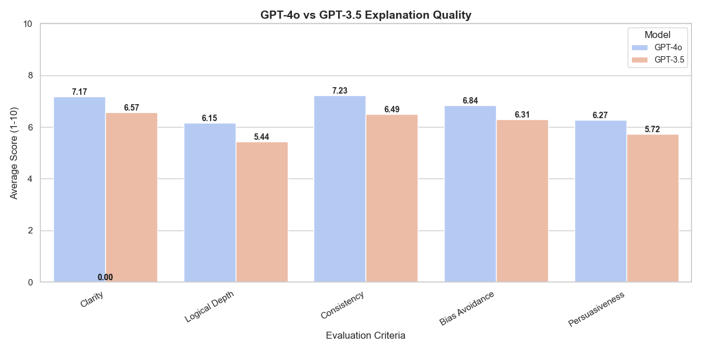
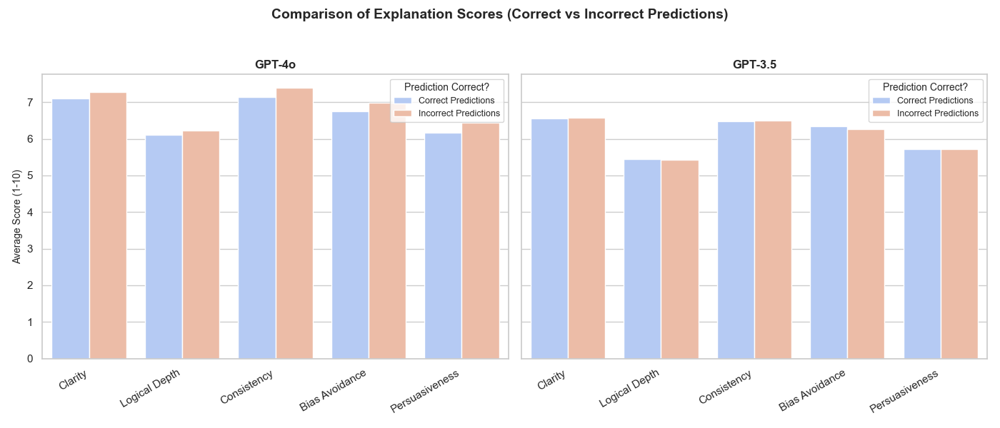

# GPT-4o vs. GPT-3.5: Persuasion Analysis on Change My View

## Project Overview
This project replicates and extends Professor Chenhao Tan’s original [Change My View (CMV)](https://chenhaot.com/papers/changemyview.html) study, which analyzed persuasive arguments on the r/ChangeMyView subreddit. The goal was to determine why certain arguments succeed in changing people's opinions, using linguistic features and interaction patterns.

Here, I investigate whether GPT-4o and GPT-3.5 can predict persuasive arguments and assess the quality of their reasoning when justifying their choices.

---

## Motivation
Professor Tan's original CMV study used machine learning models trained on handcrafted linguistic features to predict whether a response would win a delta (change the OP’s mind). With the rise of generative AI models like GPT-4o, I explore:

Can GPT models predict persuasive arguments more accurately than traditional ML models?  
How does GPT-4o compare to GPT-3.5 in predicting persuasion?  
Do better explanations correlate with higher accuracy?  
Are LLMs biased in how they score explanations?

---

## Methodology
### **Dataset**
- I use the CMV Pair Task dataset, which contains argument pairs where:
  - One argument successfully changed the OP’s mind (persuasive).
  - One argument did not change the OP’s mind (non-persuasive).

### **Model Predictions**
- GPT-4o and GPT-3.5 were each given 500 identical samples.
- Each model was tasked with predicting which counterargument was persuasive.
- Each model was also asked to justify its choice.

### **Evaluating Explanation Quality**
To assess reasoning ability, I used GPT-4o to rate each explanation (1-10) on:
1. Clarity – How well is the reasoning articulated?
2. Logical Depth – Does it consider multiple perspectives?
3. Consistency – Does the reasoning follow a structured argument?
4. Bias Avoidance – Is the justification neutral?
5. Persuasiveness – Would this explanation convince a human?

---

## Results

### **Accuracy Comparison**
| Model    | Accuracy |
|----------|---------|
| **GPT-4o**  | **63.00%** |
| **GPT-3.5** | **49.80%** |

- GPT-4o significantly outperforms GPT-3.5 in predicting persuasion.  
- GPT-3.5 is slightly better than random chance (50%), but struggles in distinguishing persuasive arguments.

---

### **Explanation Quality (Overall Averages)**
GPT-4o consistently provides higher-quality explanations across all evaluation criteria.

| Evaluation Metric    | **GPT-4o** | **GPT-3.5** |
|---------------------|------|------|
| **Clarity**        | 7.17 | 6.57 |
| **Logical Depth**  | 6.15 | 5.44 |
| **Consistency**    | 7.23 | 6.49 |
| **Bias Avoidance** | 6.83 | 6.31 |
| **Persuasiveness** | 6.27 | 5.72 |

- GPT-4o generates more logically sound and structured justifications
- GPT-3.5 tends to produce shallower and less persuasive explanations 

---

### **Explanation Scores: Correct vs. Incorrect Predictions**
Interestingly, GPT-4o assigns slightly higher scores to incorrect answers, while GPT-3.5 remains fairly consistent.

#### **GPT-4o Explanation Scores**
| Metric        | Correct Predictions | Incorrect Predictions |
|--------------|--------------------|----------------------|
| **Clarity**        | 7.11 | 7.27 |
| **Logical Depth**  | 6.11 | 6.23 |
| **Consistency**    | 7.14 | 7.39 |
| **Bias Avoidance** | 6.75 | 6.98 |
| **Persuasiveness** | 6.17 | 6.45 |

#### **GPT-3.5 Explanation Scores**
| Metric        | Correct Predictions | Incorrect Predictions |
|--------------|--------------------|----------------------|
| **Clarity**        | 6.56 | 6.57 |
| **Logical Depth**  | 5.45 | 5.43 |
| **Consistency**    | 6.48 | 6.50 |
| **Bias Avoidance** | 6.34 | 6.27 |
| **Persuasiveness** | 5.73 | 5.71 |

- GPT-4o explanations remain strong even when incorrect, possibly indicating hallucinated confidence 
- GPT-3.5’s explanations are more consistent but lack depth

---

## Summary of results
- GPT-4o is significantly better than GPT-3.5 at predicting persuasive arguments (63% vs. 49.8%)  
- GPT-4o provides more persuasive and logically structured explanations  
- Both models struggle with reasoning in incorrect answers, but GPT-4o is more confident even when wrong  

---

## Technical decisions/thought process

- I chose the pair task dataset because it provided a straightforward means of analyzing LLM decision-making: since we had labeled pairs of convinced/unconvincing responses, it would be easy to benchmark the two models' predictive performance.
- To ensure the experiment was fair, I made sure that the sample of pair tasks used by 4o and 3.5 was the same, and that they received identical instructions (the function I created to generate the outputs was identical for both models, with only the 'model' parameter being different)
- A challenge I faced was that some of the argument texts were nested within JSON structures, so I had to pay particular attention when extracting them. 

- Model choice: I chose 4o and 3.5 because I wanted to compare a SOTA model against an older model. I initially wanted to compare the performance of o1 vs 4o, but due to budget considerations decided to compare 4o and 3.5.

- Evaluation of explanation quality: I considered using human evaluation, but due to the scale of the experiment (and not wanting to introduce my own scoring bias) decided to use 4o to score explanations. There is an inherent 'conflict-of-interest' type issue here, since half of the explanations 4o was evaluating were generated by 4o. Future related studies may benefit from using either human evaluation or evaluation by a model that was not involved in generating the guesses.
- Prompt engineering: Because I was querying the LLMs to provide numerical scores (first in deciding which of the two arguments was convincing, and second in providing evaluation scores), I had to create a prompt that ensured that the responses would be numerical, and formatted in a consistent manner which would make data extraction easy once I received the responses. This involved specifying the format I wanted the numerical answers in, and highlighting that I needed the answers in that **exact** format.

---

## Ideas for future work

- Fine-tuning: Would fine-tuning GPT models on past CMV arguments improve its accuracy?
- Could using RAG improve argument quality? For example, we could retrieve past CMV discussions, which may allow the model to provide responses that are more contextually appropriate.
- Getting an LLM to learn from the original CMV paper: if we trained a model on the original paper, would its accuracy improve? I think that if a model had access to the findings of the original paper, and could consider participant entry order, back-and-forth exchanges, and language factors explicitly, it may be able to better predict whether an argument was persuasive (and potentially generate more persuasive arguments of its own). 

---

## How to reproduce this experiment
- Clone this repo and install dependencies by running pip install -r requirements.txt
- Run the cmv_get_output notebook to get each model's predictions on the sample set
- Run the cmv_analysis notebook to have the model analyze the quality of explanations, and visualize the results

